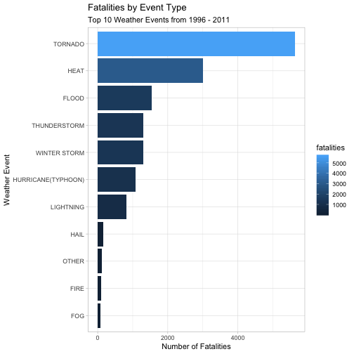
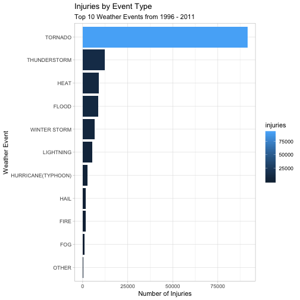
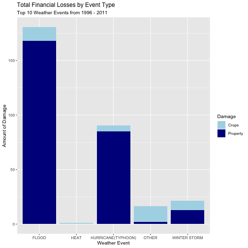

## Quantification of the Effect of Storms and Weather Events on Health and Finance

# Synopsis of study:

This assignment involves the data collected by the U.S. National Oceanic and Atmospheric Administration (NOAA). This database tracks characteristics of storms and weather events and related effects in the United States. Since these have a massive impact on the life so preventing such results to the possible extent is of great concern.

# Questions:

It will be used to answer the following questions:
        1. Across the United States, which types of events (as indicated in the EVTYPE variable) are most harmful with respect to population health?
        2. Across the United States, which types of events have the greatest economic consequences?

## Preprocessing the data

The data was downloaded from the course website, and preprocessed, analyzed, and reported using R. The results file contains all the explanations for methods, estimates, and results.

# Loading the data

The data will be loaded from the following location:


```r
data <- read.csv("/Users/ziaa/Desktop/Reproducible_research/repdata_data_StormData.csv")
stormdata <- data[c("EVTYPE", "FATALITIES", "INJURIES", "PROPDMG", "PROPDMGEXP", "CROPDMG", "CROPDMGEXP")]

# To see the type and format of data

str(data)
```

```
## 'data.frame':	902297 obs. of  37 variables:
##  $ STATE__   : num  1 1 1 1 1 1 1 1 1 1 ...
##  $ BGN_DATE  : Factor w/ 16335 levels "1/1/1966 0:00:00",..: 6523 6523 4242 11116 2224 2224 2260 383 3980 3980 ...
##  $ BGN_TIME  : Factor w/ 3608 levels "00:00:00 AM",..: 272 287 2705 1683 2584 3186 242 1683 3186 3186 ...
##  $ TIME_ZONE : Factor w/ 22 levels "ADT","AKS","AST",..: 7 7 7 7 7 7 7 7 7 7 ...
##  $ COUNTY    : num  97 3 57 89 43 77 9 123 125 57 ...
##  $ COUNTYNAME: Factor w/ 29601 levels "","5NM E OF MACKINAC BRIDGE TO PRESQUE ISLE LT MI",..: 13513 1873 4598 10592 4372 10094 1973 23873 24418 4598 ...
##  $ STATE     : Factor w/ 72 levels "AK","AL","AM",..: 2 2 2 2 2 2 2 2 2 2 ...
##  $ EVTYPE    : Factor w/ 985 levels "   HIGH SURF ADVISORY",..: 834 834 834 834 834 834 834 834 834 834 ...
##  $ BGN_RANGE : num  0 0 0 0 0 0 0 0 0 0 ...
##  $ BGN_AZI   : Factor w/ 35 levels "","  N"," NW",..: 1 1 1 1 1 1 1 1 1 1 ...
##  $ BGN_LOCATI: Factor w/ 54429 levels ""," Christiansburg",..: 1 1 1 1 1 1 1 1 1 1 ...
##  $ END_DATE  : Factor w/ 6663 levels "","1/1/1993 0:00:00",..: 1 1 1 1 1 1 1 1 1 1 ...
##  $ END_TIME  : Factor w/ 3647 levels ""," 0900CST",..: 1 1 1 1 1 1 1 1 1 1 ...
##  $ COUNTY_END: num  0 0 0 0 0 0 0 0 0 0 ...
##  $ COUNTYENDN: logi  NA NA NA NA NA NA ...
##  $ END_RANGE : num  0 0 0 0 0 0 0 0 0 0 ...
##  $ END_AZI   : Factor w/ 24 levels "","E","ENE","ESE",..: 1 1 1 1 1 1 1 1 1 1 ...
##  $ END_LOCATI: Factor w/ 34506 levels ""," CANTON"," TULIA",..: 1 1 1 1 1 1 1 1 1 1 ...
##  $ LENGTH    : num  14 2 0.1 0 0 1.5 1.5 0 3.3 2.3 ...
##  $ WIDTH     : num  100 150 123 100 150 177 33 33 100 100 ...
##  $ F         : int  3 2 2 2 2 2 2 1 3 3 ...
##  $ MAG       : num  0 0 0 0 0 0 0 0 0 0 ...
##  $ FATALITIES: num  0 0 0 0 0 0 0 0 1 0 ...
##  $ INJURIES  : num  15 0 2 2 2 6 1 0 14 0 ...
##  $ PROPDMG   : num  25 2.5 25 2.5 2.5 2.5 2.5 2.5 25 25 ...
##  $ PROPDMGEXP: Factor w/ 19 levels "","-","?","+",..: 17 17 17 17 17 17 17 17 17 17 ...
##  $ CROPDMG   : num  0 0 0 0 0 0 0 0 0 0 ...
##  $ CROPDMGEXP: Factor w/ 9 levels "","?","0","2",..: 1 1 1 1 1 1 1 1 1 1 ...
##  $ WFO       : Factor w/ 542 levels ""," CI","%SD",..: 1 1 1 1 1 1 1 1 1 1 ...
##  $ STATEOFFIC: Factor w/ 250 levels "","ALABAMA, Central",..: 1 1 1 1 1 1 1 1 1 1 ...
##  $ ZONENAMES : Factor w/ 25112 levels "","                                                                                                               "| __truncated__,..: 1 1 1 1 1 1 1 1 1 1 ...
##  $ LATITUDE  : num  3040 3042 3340 3458 3412 ...
##  $ LONGITUDE : num  8812 8755 8742 8626 8642 ...
##  $ LATITUDE_E: num  3051 0 0 0 0 ...
##  $ LONGITUDE_: num  8806 0 0 0 0 ...
##  $ REMARKS   : Factor w/ 436781 levels "","\t","\t\t",..: 1 1 1 1 1 1 1 1 1 1 ...
##  $ REFNUM    : num  1 2 3 4 5 6 7 8 9 10 ...
```

```r
# To look at data
head(stormdata)
```

```
##    EVTYPE FATALITIES INJURIES PROPDMG PROPDMGEXP CROPDMG CROPDMGEXP
## 1 TORNADO          0       15    25.0          K       0           
## 2 TORNADO          0        0     2.5          K       0           
## 3 TORNADO          0        2    25.0          K       0           
## 4 TORNADO          0        2     2.5          K       0           
## 5 TORNADO          0        2     2.5          K       0           
## 6 TORNADO          0        6     2.5          K       0
```

```r
tail(stormdata)
```

```
##                EVTYPE FATALITIES INJURIES PROPDMG PROPDMGEXP CROPDMG
## 902292 WINTER WEATHER          0        0       0          K       0
## 902293      HIGH WIND          0        0       0          K       0
## 902294      HIGH WIND          0        0       0          K       0
## 902295      HIGH WIND          0        0       0          K       0
## 902296       BLIZZARD          0        0       0          K       0
## 902297     HEAVY SNOW          0        0       0          K       0
##        CROPDMGEXP
## 902292          K
## 902293          K
## 902294          K
## 902295          K
## 902296          K
## 902297          K
```


##Setting Up required libraries:


```r
library(plyr)
```

```
## -------------------------------------------------------------------------
```

```
## You have loaded plyr after dplyr - this is likely to cause problems.
## If you need functions from both plyr and dplyr, please load plyr first, then dplyr:
## library(plyr); library(dplyr)
```

```
## -------------------------------------------------------------------------
```

```
## 
## Attaching package: 'plyr'
```

```
## The following objects are masked from 'package:dplyr':
## 
##     arrange, count, desc, failwith, id, mutate, rename, summarise,
##     summarize
```

```r
library(ggplot2)
library(dplyr)
```

## Data cleaning:

To clean the data, we need to convert two variables in required format i.e., from factor to numerical. We can see from the structure of data that Property Damage Exponent (PROPDMGEXP) and Crop Damage Exponent(CROPDMGEXP) contain the code for the exponent of damage. We need to convert these variables into a numerical value.


```r
stormdata$PROPDMGEXP<- mapvalues(stormdata$PROPDMGEXP, from = c("K", "M","", "B", "m", "+", "0", "5", "6", "?", "4", "2", "3", "h", "7", "H", "-", "1", "8"), to = c(10^3, 10^6, 1, 10^9, 10^6, 0,1,10^5, 10^6, 0, 10^4, 10^2, 10^3, 10^2, 10^7, 10^2, 0, 10, 10^8))
stormdata$PROPDMGEXP<- as.numeric(as.character(stormdata$PROPDMGEXP))
stormdata$PROPDMGTOTAL<- (stormdata$PROPDMG * stormdata$PROPDMGEXP)/1000000000

stormdata$CROPDMGEXP<- mapvalues(stormdata$CROPDMGEXP, from = c("","M", "K", "m", "B", "?", "0", "k","2"), to = c(1,10^6, 10^3, 10^6, 10^9, 0, 1, 10^3, 10^2))
stormdata$CROPDMGEXP<- as.numeric(as.character(stormdata$CROPDMGEXP))
stormdata$CROPDMGTOTAL<- (stormdata$CROPDMG * stormdata$CROPDMGEXP)/1000000000

stormdata$DAMAGETOTAL<- stormdata$PROPDMGTOTAL + stormdata$CROPDMGEXP

detach(package:plyr)
```

## Organizing data:

After cleaning if we see the data, we will notice that there are many related natural weather events in the ENVTYPE column. So we can group these according to their type. For this, we can use grepl function, as shown below:


```r
storm_type<- stormdata %>%
  mutate(evtypegrp = ifelse(grepl("LIGHTNING|LIGNTNING", EVTYPE), "LIGHTNING", ifelse(grepl("HAIL|RAIN|HEAVY RAIN", EVTYPE), "HAIL", ifelse(grepl("FLOOD|WET|FLD", EVTYPE), "FLOOD", ifelse(grepl("SNOW|WINTER|WINTRY|BLIZZARD|SLEET|COLD|ICE|FREEZE|AVALANCHE|ICY", EVTYPE), "WINTER STORM",
ifelse(grepl("TORNADO|FUNNEL", EVTYPE), "TORNADO",
ifelse(grepl("WIND|STORM|THUNDER|TSTM|TROPICAL +STORM", EVTYPE), "THUNDERSTORM",
ifelse(grepl("FIRE", EVTYPE), "FIRE",
ifelse(grepl("FOG|VISIBILITY|DARK|DUST", EVTYPE), "FOG",
ifelse(grepl("HURRICAN|WAVE|SURF|SURGE|TIDE|TSUNAMI|CURRENT|SWELL", EVTYPE), "HURRICANE(TYPHOON)",
ifelse(grepl("HEAT|HIGH +TEMP|RECORD +TEMP|WARM|DRY", EVTYPE), "HEAT", "OTHER")))))))))))
```

## Results:

After processing and cleaning data, now we can analyze the data. For this purpose, we need to summarize the data to answer the question. First, we will create a summary of the four different damage types.


```r
damage_sum<- storm_type %>% group_by(evtypegrp) %>% summarise(damage = sum(DAMAGETOTAL), property= sum(PROPDMGTOTAL), crops = sum(CROPDMGTOTAL), fatalities = sum(FATALITIES), injuries = sum(INJURIES))
```

## Question 1: Types of events that are most harmful with respect to population health?

To answer this, we will create graphs that show the events resulting in the high number of deaths and injuries in the United States.


```r
par(mfrow=c(1,2))
par(mar=c(8,4,2,2))
ggplot(damage_sum, aes(x = reorder(evtypegrp, +fatalities), y = fatalities, fill = fatalities)) +
        geom_bar(stat = "identity") +
        coord_flip() +
        theme_light() +
        labs(title = "Fatalities by Event Type", 
             subtitle = "Top 10 Weather Events from 1996 - 2011", 
             x = "Weather Event",
             y = "Number of Fatalities")
```



```r
ggplot(damage_sum, aes(x =reorder(evtypegrp, +injuries), y = injuries, fill = injuries)) +
        geom_bar(stat = "identity") +
        coord_flip() +
        theme_light() +
        labs(title = "Injuries by Event Type", 
             subtitle = "Top 10 Weather Events from 1996 - 2011", 
             x = "Weather Event",
             y = "Number of Injuries")
```


## Question 2: Types of events that have the greatest economic consequences?

To answer this, we will create a graph again that show the events resulting in severe economic damage in the United States. As we can only have three figures for this assignment. We can use the "par" function to make multiple panel plots, or we can combine the financial damage in one graph. 


```r
financialdamage <-head(damage_sum[order(damage_sum$damage, decreasing=TRUE),],5)
property <- financialdamage %>% mutate(damage_type="Property", damage_amount=property)
crops <- financialdamage %>% mutate(damage_type="Crops", damage_amount=crops)
combine_damage <- rbind(property,crops)

ggplot(combine_damage, aes(evtypegrp, damage_amount, fill=factor(damage_type))) +
  geom_bar(stat = "identity") + 
        scale_fill_manual("Damage", values = c("Crops" = "light blue", "Property" = "dark blue")) +
        theme_light() +
  labs(title = "Total Financial Losses by Event Type", 
             subtitle = "Top 10 Weather Events from 1996 - 2011",
             x = "Weather Event",
             y = "Amount of Damage")  +
  theme_gray(base_size = 10, base_family = "")
```



## Conclusion:

We can see from the data that organized, and clean data is more easy to analyze. The results of this assignment clearly show that the weather events affect the health and economy, but the type of event that results in more damage is different for both, i.e., health & finance.
